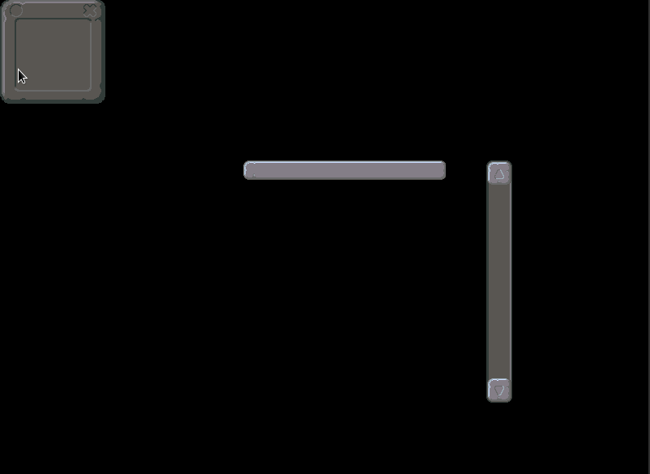
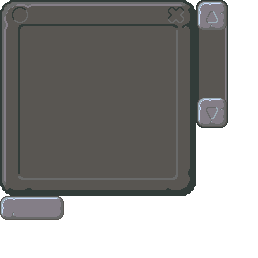

# Love2D-Nine-and-Three-Slices
Lib used for creating 9-Slices or 3-Slices for Love2D

```lua
Class = require 'libs.class'
require 'libs.graphics.NineSlice'
require 'libs.graphics.ThreeSlice'
gTexture = love.graphics.newImage('graphics/ui.png')
window = NineSlice.generateFromRect(gTexture, 0,0, 196, 196)
window:set(0, 0, love.mouse.getX(), love.mouse.getY(), true, true
function love.draw()
  window:render()
end
```




### Original Image Comparison




# How to 9-Slice
It is possible to give 9 different quads in the constructor:
The order of definition will always be
[0, 1, 2]
[3, 4, 5]
[6, 7, 8]
```lua
NineSlice(gTextures['ui'],
    love.graphics.newQuad(x, y, w, h, gTextures['ui']:getDimensions()),
    love.graphics.newQuad(x, y, w, h, gTextures['ui']:getDimensions()),
    love.graphics.newQuad(x, y, w, h, gTextures['ui']:getDimensions()),
    love.graphics.newQuad(x, y, w, h, gTextures['ui']:getDimensions()),
    love.graphics.newQuad(x, y, w, h, gTextures['ui']:getDimensions()),
    love.graphics.newQuad(x, y, w, h, gTextures['ui']:getDimensions()),
    love.graphics.newQuad(x, y, w, h, gTextures['ui']:getDimensions()),
    love.graphics.newQuad(x, y, w, h, gTextures['ui']:getDimensions()),
    love.graphics.newQuad(x, y, w, h, gTextures['ui']:getDimensions()))
```
This way gives you freedom for creating a quad for any size and using it on nineslice, if your nine slice is simpler, then, just call:
```lua
  NineSlice.generateFromRect(gTexture, 0,0, width, height)
```
And you will just need to pass some width and height, it is possible too, to pass as tiles with offset:
```lua
  NineSlice.generateFromTiles(texture, startX, startY, tileWidth, tileHeight, offset_Per_Tile_X, offset_Per_Tile_Y)
```

## Setting its size
You will need to set it's size, for 9 slice
```lua
NineSlice:set((x, y, width, height, useMinimumWidth, useMinimumHeight)
```
Notice that there are optional parameters for using the minimal width and height, they are important for when setting a size lower than the corner's size sum, if you set it to true, the minimal size will always be the corner's sum

# How to 3-Slice
The ThreeSlice works in the same way, it can be generated from tiles, or just passing as a rect, but it has one additional parameter for saying whether it is horizontal type or vertical type:
```lua
ThreeSlice.generateFromTiles(texture, startX, startY, tileWidth, tileHeight, offset_Per_Tile_X, offset_Per_Tile_Y, isHorizontal)
```

The default constructor allow passing 3 different quads too, the order is a little more intuitive, as it is quad1, stretching, and quad3:
```lua
ThreeSlice(texture,isHorizontal, quad1, stretchingQuad, quad3)
```
When passing as a rect, you won't need to tell if it is horizontal or vertical, it is already predictable from the rect size:
```lua
ThreeSlice.generateFromRect(texture, x, y, width, height)
```
## Setting its size
The difference from the NineSlice, is that it will clamp to the minimum size, that is, using the minimal size that is not from the stretching side, e.g: If it is vertical, it will set the height always to the non-stretching size
```lua
  ThreeSlice:set(x, y, width, height, useMinimum)
```

## Importing and using it
- Download class.lua, NineSlice.lua, ThreeSlice.lua
- Include it by adding onto the top of your main `Class = require 'class'`, then `require 'NineSlice'`, then `require 'ThreeSlice'`
- Generate a Three/Nine-Slice
- Set its size
- Render it

## Thanks
- Thanks to Matthias Richter for providing class.lua file
- vk for providing the GUI for free: https://opengameart.org/content/match-3-gui

## Simple Example
A simple working example as shown in main.lua:
```lua
Class = require 'libs.class'
require 'libs.graphics.NineSlice'
require 'libs.graphics.ThreeSlice'

function love.load()
    gTexture = love.graphics.newImage('graphics/ui.png')

    window = NineSlice.generateFromRect(gTexture, 0,0, 196, 196)
    button = ThreeSlice.generateFromRect(gTexture, 0, 196, 64, 24)
    scroll = ThreeSlice.generateFromRect(gTexture, 196, 0, 32, 128)
    scroll:set(600, 200, 999, 300, true)
    button:set(300, 200, 250, 200, true)
end

function love.update(dt)
    window:set(0, 0, love.mouse.getX(), love.mouse.getY(), true, true)
    
end

function love.draw()
    window:render() 
    button:render()
    scroll:render()
end
```
